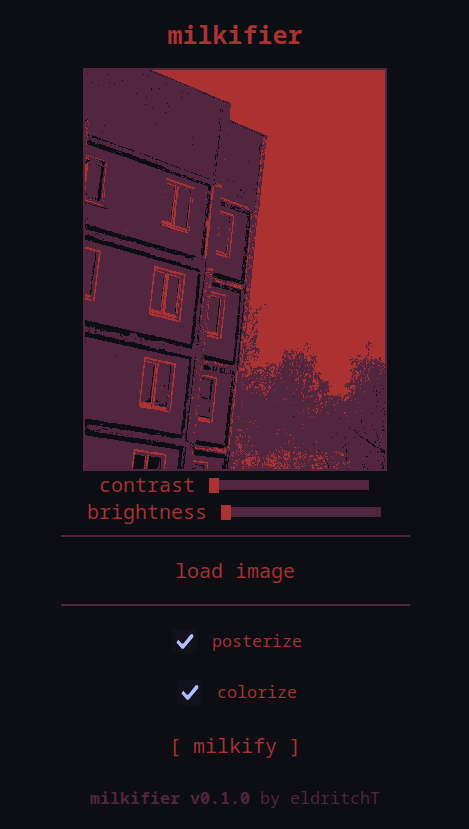

# milkifier
A simple image editing tool for stylizing your images with effects and colors inspired by [Nikita Kryukov](https://x.com/nkt_krkv)'s works.

## Features & todos
- [x] Adjusting contrast
- [ ] Adjusting brightness (works pretty strange rn, gonna reimplement)
- [x] Posterizing & colorizing
- [ ] More palettes, including custom ones
- [ ] A convenient but stylish UI/UX that makes sense

## Credits
- Visual style used in this project is inspired by Nikita Kryukov's game "[Milk outside a bag of milk outside a bag of milk](https://store.steampowered.com/app/1604000)" and [passwordpassword.online](https://passwordpassword.online), a website that is a part of Milk series

- This project is inspired (but not endorsed, supported and/or maintained) by [Saezv1l's MilkUP](https://saezv1l.itch.io/milkify), which is a more complete implementation of these visual effects made using Python and NumPy

- Some of CSS code was borrowed from [passwordpassword.online](https://passwordpassword.online)

- This project is using [g.js](https://github.com/nodebox/g.js), a graphics library for JavaScript and [JQuery](https://jquery.com/). Both are licensed under the MIT license (see [LICENSE](./LICENSE))